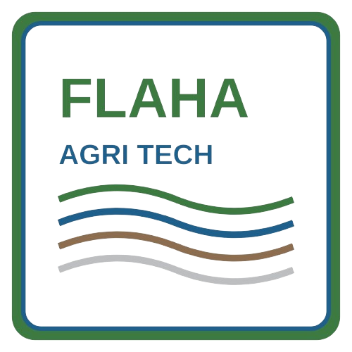
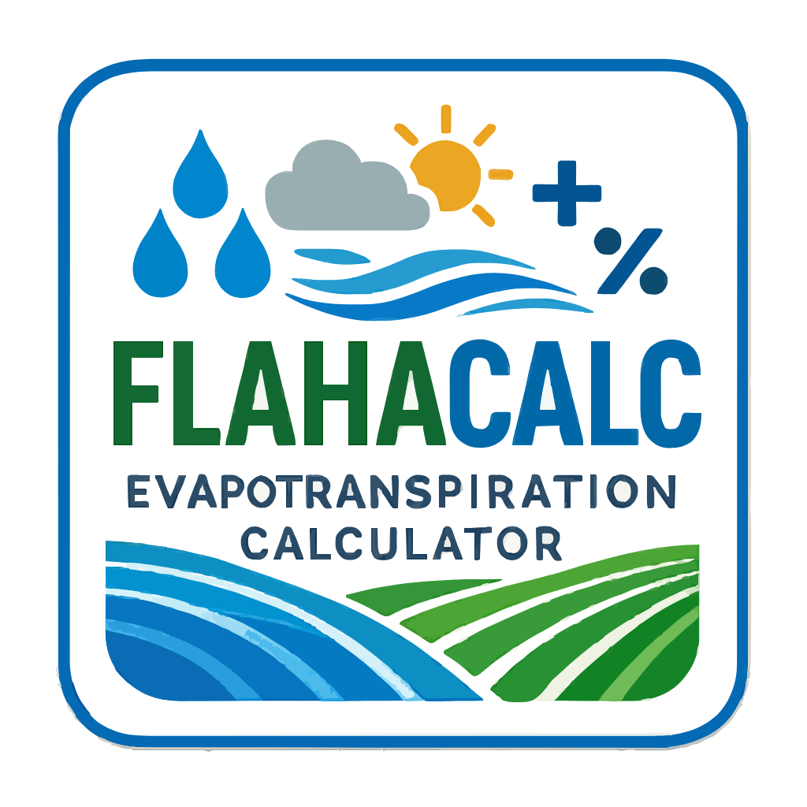
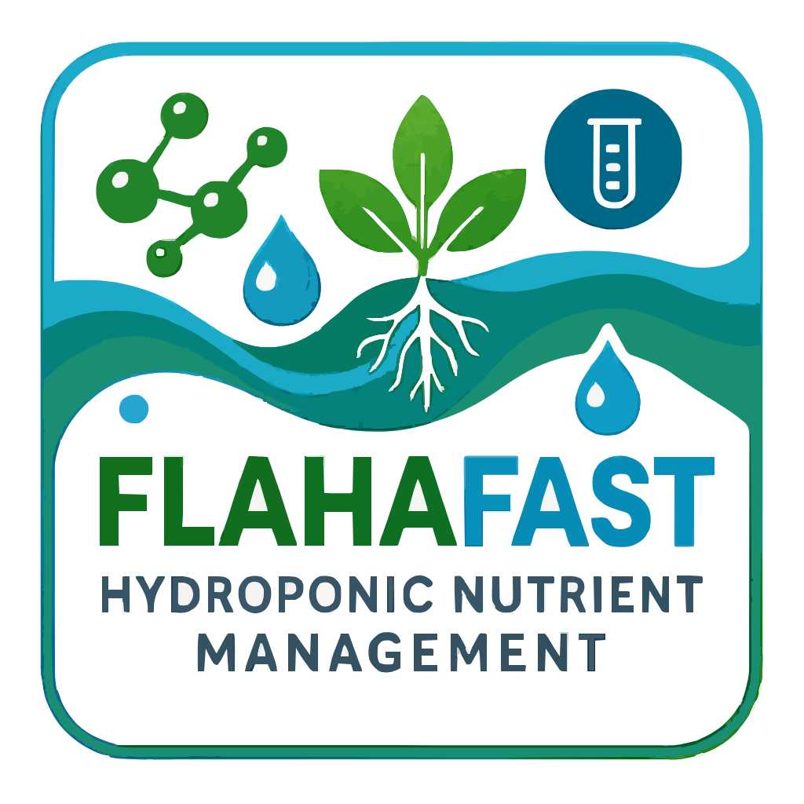
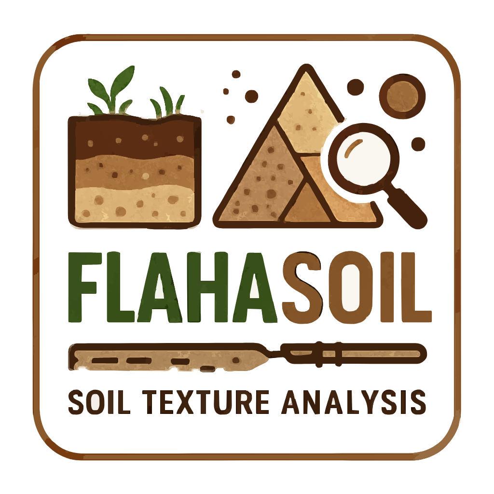
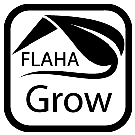
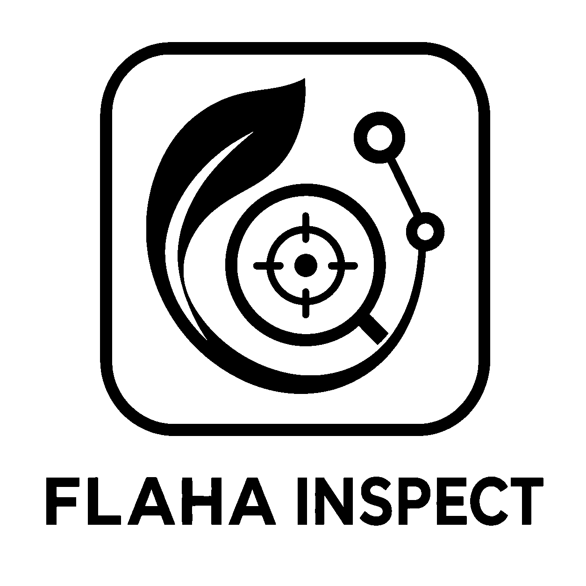

<div align="center">

<a href="https://flaha.org"></a>

# Rafat Al Khashan

### Plant science. Practical software.

<strong>Agronomy researcher &amp; developer</strong><br>
Precision agriculture · Crop nutrition · Agricultural software

<p>
  <a href="https://x.com/Rafatahmed"></a>
  <a href="https://www.linkedin.com/in/rafat-al-khashan/"></a>
  <a href="https://github.com/rafatahmed"></a>
</p>
<p>
  <a href="https://flaha.org"></a>
  <a href="https://pypi.org/project/flahax/"></a>
</p>

I turn agronomic research into practical software for crop nutrition, irrigation, soil analysis, and protected cultivation. My work connects plant science with computational models and tools that support everyday agricultural decisions.

</div>

---

## About me

I hold a **BSc in Plant Production from Jordan University of Science and Technology**, with a focus on precision crop production. My research and development interests include:

- **Crop nutrition:** nutrient formulation for hydroponic and aeroponic systems.
- **Water and soil:** evapotranspiration, irrigation planning, and agronomic interpretation of soil properties.
- **Protected cultivation:** greenhouse lighting and energy use.
- **Crop quality and field data:** citrus quality, marketable yield, and digital farm scouting.

Through my Flaha projects, I build tools that bring these areas together—from Python packages and scientific calculation engines to web and desktop applications.

---

## Published software · FlahaX

[](https://pypi.org/project/flahax/)

**[FlahaX](https://pypi.org/project/flahax/)** is my published Python package for fertilizer formulation, bounded aqueous chemistry, and auditable delivery planning. It calculates fertilizer combinations and salt quantities against crop nutrient targets while accounting for nutrients already present in source water.

```bash
python -m pip install flahax
```

[PyPI package](https://pypi.org/project/flahax/) · [Source code](https://github.com/rafatahmed/Flahax) · [Documentation](https://github.com/rafatahmed/Flahax/tree/main/docs)

---

## Selected projects

| Project | Focus | What I’m building |
| --- | --- | --- |
| <a href="https://github.com/rafatahmed/FlahaCalc"></a><br>**[FlahaCalc](https://github.com/rafatahmed/FlahaCalc)** | Water | Reference evapotranspiration calculations using FAO-56 and ASCE methods, with calculation history and exports. |
| <a href="https://github.com/rafatahmed/FlahaFast"></a><br>**[FlahaFAST](https://github.com/rafatahmed/FlahaFast)** | Nutrition | Hydroponic nutrient decision support organized around projects, crops, seasons, and nutrient solutions. |
| <a href="https://github.com/rafatahmed/FlahaSoil"></a><br>**[FlahaSOIL](https://github.com/rafatahmed/FlahaSoil)** | Soil | Soil water physics, soil chemistry, and agronomic interpretation with scientific charts and reports. |
| <a href="https://github.com/rafatahmed/FlahaGrow"></a><br>**[FlahaGrow](https://github.com/rafatahmed/FlahaGrow)** | Light | A Rhino/Grasshopper plugin for greenhouse daylight and electric-light studies, PPFD/DLI analysis, and lighting-energy calculations using Radiance. |
| <a href="https://github.com/rafatahmed/FlahaMAP"></a><br>**[FlahaMAP](https://github.com/rafatahmed/FlahaMAP)** | Mapping | A desktop application for local date-palm detection, inventory, and image-based mapping. |
| <a href="https://github.com/rafatahmed/FlahaINSPECT"></a><br>**[FlahaINSPECT](https://github.com/rafatahmed/FlahaINSPECT)** | Fieldwork | Field inspection workflows with geotagged photos, offline capture, map review, and PDF reporting. |

Each repository documents its own setup, development status, and supported capabilities.

---

## Tools I work with

- **Scientific computing:** Python, numerical models, and agronomic calculation engines.
- **Application development:** TypeScript, React, Node.js, and PostgreSQL.
- **Spatial and environmental workflows:** mapping, computer vision, Rhino/Grasshopper, and Radiance.

---

## Connect

Interested in precision agriculture, crop nutrition, greenhouse simulation, or agricultural software? Connect with me on [LinkedIn](https://www.linkedin.com/in/rafat-al-khashan/) or follow my work on [X](https://x.com/Rafatahmed).
